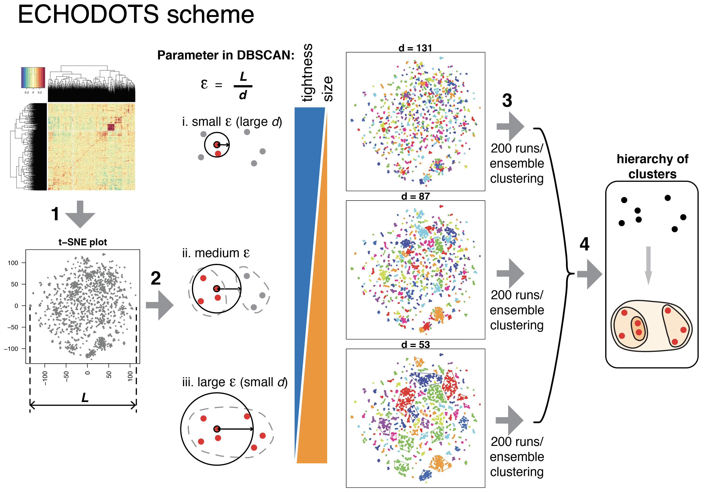

# ECHODOTS
Compute ECHODOTS (*e*nsemble *c*lustering with *h*ierarchy *o*ver *D*BSCAN *o*n *t*-SNE with *S*pearman distance matrix), a clustering algorithm based on tSNE and DBSCAN. ECHODOTS consists of four steps:
  1. t-SNE using the Spearman distance matrix
  2. DBSCAN with a different _d_
  3. Find consensus clusters for each _d_
  4. Build hierarchy between different _d_

### 01_perform_tSNE
tSNE on perturbation score profiles among essential genes is performed 200 times.
- [rtsne_original.r](01_perform_tSNE/rtsne_original.r)
- [master_rtsne_original.sh](01_perform_tSNE/master_rtsne_original.sh)

### 02_perform_dbscan
DBSCAN and ensemble clustering on tSNE coordinates is performed.
- [assemble_rtsne_dbscan.r](02_perform_dbscan/assemble_rtsne_dbscan.r)
- [master_assemble_rtsne_dbscan.sh](02_perform_dbscan/master_assemble_rtsne_dbscan.sh)

### 03_assemble_clue
Ensemble clusters computed with different _d_ (equivalently _epsilon_) are compared.
- [assembly_cluster_original.r](03_assemble_clue/assembly_cluster_original.r)
- [summary_cluster_original.r](03_assemble_clue/summary_cluster_original.r)

### 04_cluster_hierarchy : build cluster hierarchy
Three levels of _d_'s are selected, and explicit hierarchy is built among the three sets of ensemble clusters.
- [cluster-hierarchy_3levels_simple.r](04_cluster_hierarchy/cluster-hierarchy_3levels_simple.r)
- [fig4fg_cluster_sel-sel-eff-scatter.r](04_cluster_hierarchy/fig4fg_cluster_sel-sel-eff-scatter.r)

